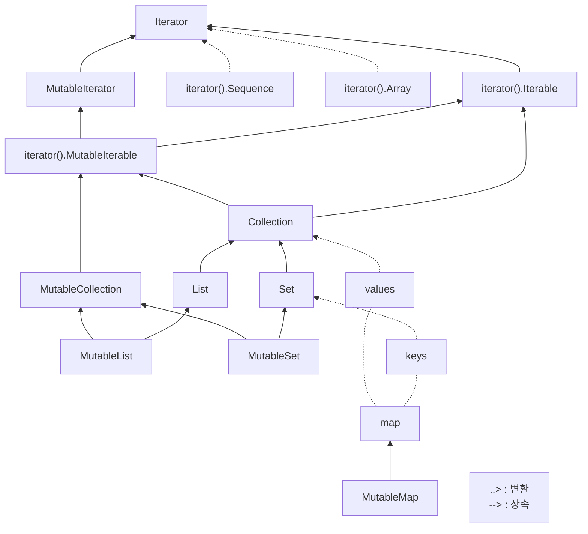

## JSON Stringify 만들기

### KClass - 코틀린 클래스 정의

클래스::class
인스턴스::class

코틀린에서 reflection은 자바에서의 reflection과 다름
코틀린 내부에서 컴파일 과정에서 도출되는 메타데이터를 정의

KClass.members - 속성, 메소드 일체를 가지고있음
Collection<KCallable<*>> - members가 KCallable의 collection으로 표현됨

- Collection - kotlin은 특정 플랫폼에 종속적이지 않으므로 kotlin 특유의 collection을 가짐
 


KCallable - 모든 호출가능 요소
KProperty - 속성, kotlin은 속성을 만들면 getter, setter도 함께 존재함
KFunction - 함수, 메소드

### String
"$변수명"
"${식}"

내부적으로 toString() 자동 호출


### stringify의 문제

```text
{a:10,b:abc,}
```
1차 작업 결과

```text
{"a":10,"b":"abc"}
```

원하는 결과 

1. 문자열이면 감싸는 따옴표를 붙임
2. 문자열안에 따옴표는 \"로 변경
3. 마지막요소는 ,를 제거